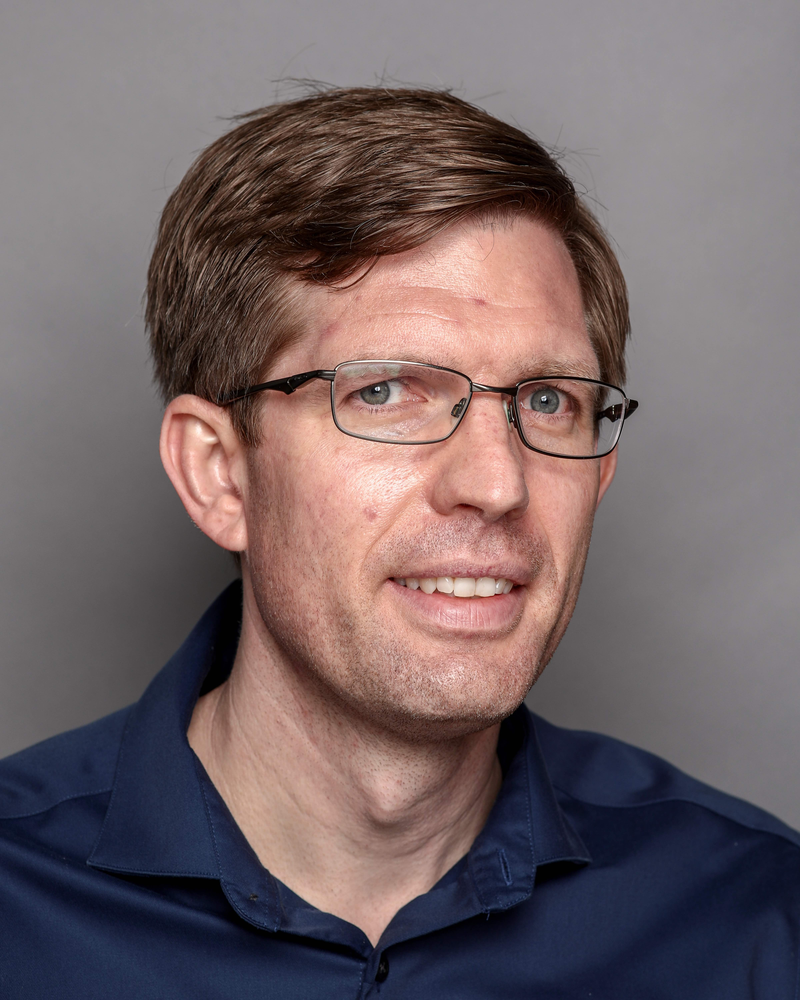
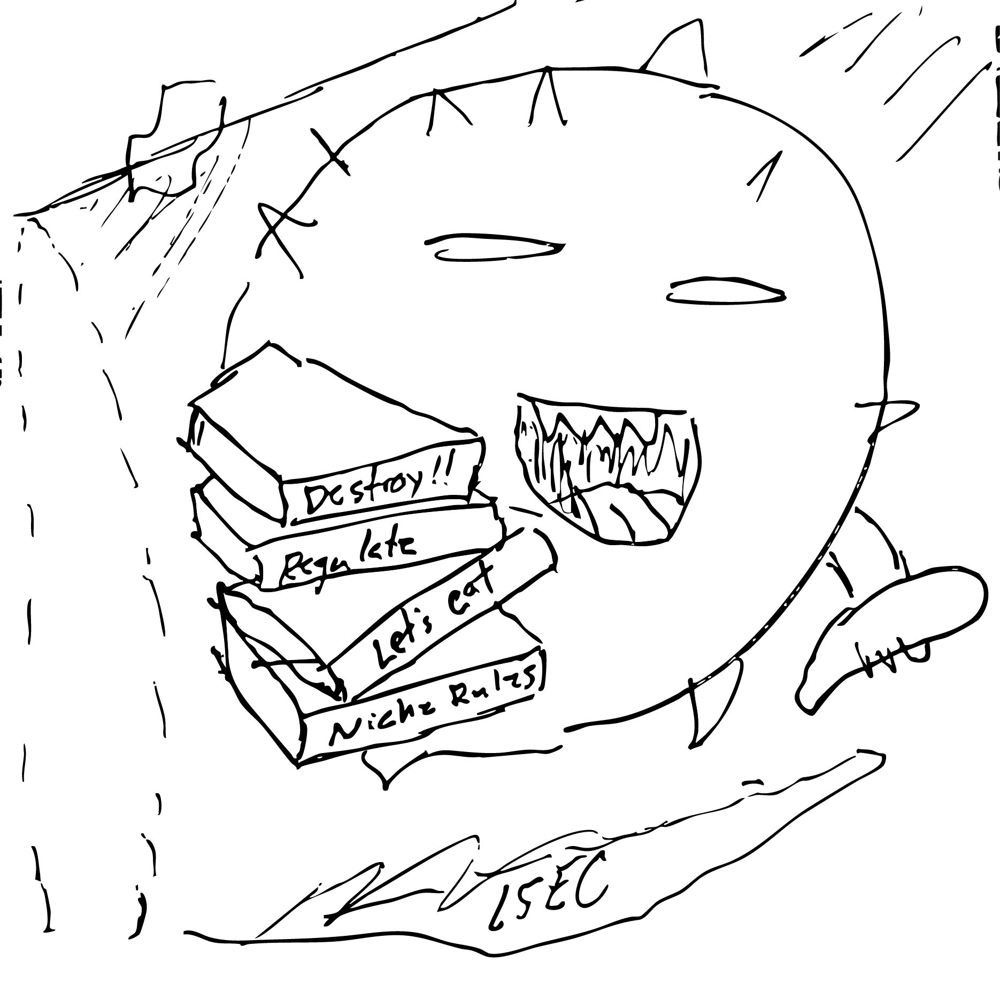

# Principal Investigator

::: {.grid}
::: {.g-col-12 .g-col-md-6}
::: {.member-card}

## **Ty D. Troutman, PhD**

{.profile-img}

More about Ty

[Ty D. Troutman, PhD](https://www.cincinnatichildrens.org/bio/t/ty-troutman)\
Cincinnati Children's Hospital Medical Center\
Division of Allergy and Immunology\
240 Albert Sabin Way\
Building S, S6.540\
Cincinnati, OH 45229\
Ty dot Troutman -at- cchmc dot org

My research broadly focuses on innate immunity and the contribution of inflammation to acute and chronic disease.
My specific research goals are to define the molecular mechanisms controlling the functions of macrophages and myeloid cells during illness.
In my lab, we often apply diverse genomics technologies to purified tissue cells.
With this strategy, we aim to decode transcriptional changes observed during disease by identifying the responsible transcription factors, upstream signaling pathways and sender cell populations.

I have used this strategy successfully to 1) identify a hierarchical framework controlling niche specification of macrophages, 2) discover transcriptional mechanisms controlling functional diversification of macrophages during nonalcoholic steatohepatitis, and 3) predict cis and trans-acting factors promoting response differences from genetically diverse individuals.
This framework requires the tool kit of a cellular immunologist, a molecular biologist and a computational biologist.

I've been a researcher for over 19 years and started working at Cincinnati Children’s in 2021.
Throughout my career, I have been fortunate to receive support from many scientific mentors.
At the University of Texas (UT) at San Antonio, I was trained by Drs. Bernard Arulanandam and M. Neal Guenztel, while studying the immunological regulation of *Vibrio cholerae* pathogenesis.
This experience established my desire for a career in science.
I performed doctoral research under Dr. Chandrashekhar Pasare at UT Southwestern, defining new signaling mechanisms through the Toll-like receptor/interleukin one receptor (TLR/IL1R) superfamily.
Finally, I trained with Dr. Christopher K. Glass at the University of California San Diego on gene regulation of macrophages during development and disease.
These experiences have honed my value of scientific rigor and research mentorship, which I now use in my lab at Cincinnati Children’s.

:::
::: 
::: {.g-col-12 .g-col-md-6}

:::
:::

# Research Staff

::: {.grid}
::: {.g-col-12 .g-col-md-6}
::: {.member-card}

## **Yusuf Barudi, MS**

**Research Assistant**

{.profile-img}

More

I joined the lab in 2022 after completing my Master of Science at the University of Toledo Medical Campus, where I focused on the role of E-cadherin in sensitizing human colonic cancer cells to ferroptosis.

My current research focuses on the consequences of natural genetic diversity in the inflammatory mechanisms of macrophages.

:::
:::

::: {.g-col-12 .g-col-md-6}
::: {.member-card}

## **Langley Williams, BS**

**Research Assistant**

{.profile-img}

More

I completed a bachelor of science at the Georgia Institute of Technology and then researched the roles of neutrophil-mediated inflammation in the pathogenesis of endometriosis at the University of Cincinnati.

I joined the lab in 2023 and am currently defining the roles of Kupffer cells and other hepatic macrophages in the pathogenesis of metabolic dysfunction-associated steatotic liver disease.

:::
:::
:::

# Graduate Students

::: {.grid}
::: {.g-col-12 .g-col-md-6}
::: {.member-card}

## **Jihye Kang, MS**

**IGP PhD Candidate**

{.profile-img}

More

I completed a master’s degree in biochemistry at Western Kentucky University, where I studied the function of transcription activator-like effectors in DNA editing.

I joined the lab in 2024 and am investigating the molecular crosstalk between cellular stress and inflammation.

:::
:::

::: {.g-col-12 .g-col-md-6}
::: {.member-card}

## **Amelia Pearson, BS**

**IGP PhD Candidate**

{.profile-img}

More

I completed a bachelor of science at the Georgia Institute of Technology and then researched the roles of neutrophil-mediated inflammation in the pathogenesis of endometriosis at the University of Cincinnati.

I joined the lab in 2023 and am currently defining the roles of Kupffer cells and other hepatic macrophages in the pathogenesis of metabolic dysfunction-associated steatotic liver disease.

:::
:::
:::

# Undergraduate Researchers

::: {.grid}
::: {.g-col-12 .g-col-md-6}
::: {.member-card}

## **Mohammed Haroon**

**University of Cincinnati Honors Program**

{.profile-img}

More

I joined the lab in 2025 and am currently defining the roles of macrophage ATF3 in inflammation and efferocytosis.

:::
:::

::: {.g-col-12 .g-col-md-6}
::: {.member-card}

## **Gianna Rodriguez-Romero**

**University of Cincinnati Honors Program**

{.profile-img}

More

I joined the lab in 2026 and am defining the molecular crosstalk between cellular stress and MAP kinase-induced inflammation.

:::
:::
:::